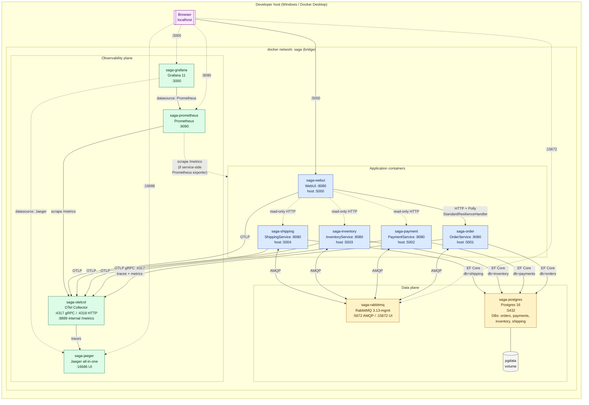
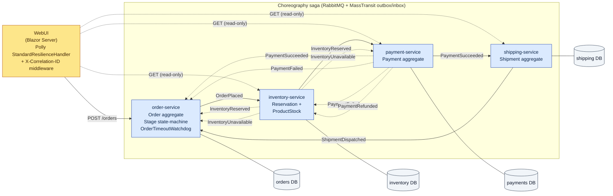
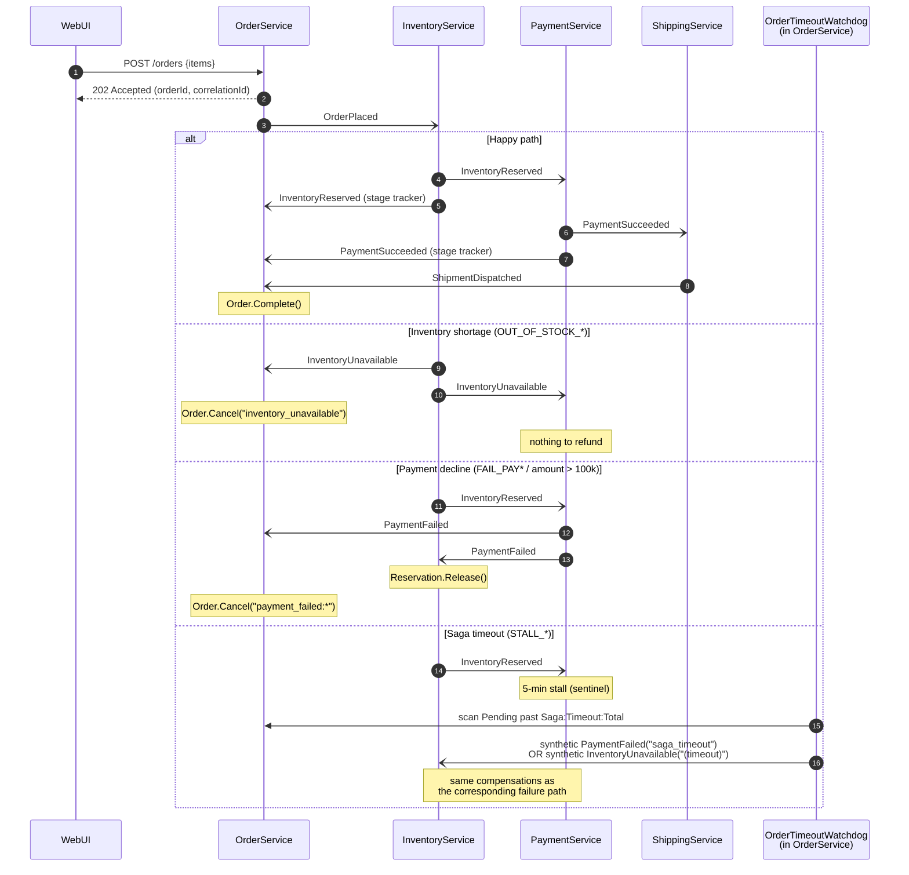

# Architecture diagrams — current state

Snapshot of the **as-built** system on 2026-06-16. Two views:

1. **Infrastructure** — what actually runs (containers, ports, volumes, networks) per [docker-compose.yml](../docker-compose.yml).
2. **Application** — bounded contexts, sync vs async edges, and the choreography saga per [docs/architecture.md](architecture.md).

Both diagrams are Mermaid. They render natively on GitHub and in VS Code's Markdown preview.

---

## 1. Infrastructure view

Single Docker network `saga` (bridge). One Postgres container hosts four logical DBs (`orders`, `payments`, `inventory`, `shipping`) created by [build/postgres/init.sql](../build/postgres/init.sql). All telemetry is funnelled through the OTel Collector before fanning out to Jaeger and Prometheus.



### Container roster

| Container | Image | Host port → container | Role |
|---|---|---|---|
| `saga-webui` | built from `build/docker/Dockerfile.dotnet` (`SERVICE_NAME=WebUI`) | 5000 → 8080 | Blazor Server UI; only sync HTTP client |
| `saga-order` | …`SERVICE_NAME=OrderService` | 5001 → 8080 | Order aggregate, saga timeout watchdog, stage tracker |
| `saga-payment` | …`SERVICE_NAME=PaymentService` | 5002 → 8080 | Payment aggregate, charge / refund |
| `saga-inventory` | …`SERVICE_NAME=InventoryService` | 5003 → 8080 | Reservation aggregate, stock guard |
| `saga-shipping` | …`SERVICE_NAME=ShippingService` | 5004 → 8080 | Shipment aggregate |
| `saga-rabbitmq` | `rabbitmq:3.13-management` | 5672 / 15672 | Message broker + management UI |
| `saga-postgres` | `postgres:16` | 5432 | Per-service logical DBs (`pgdata` volume) |
| `saga-jaeger` | `jaegertracing/all-in-one:1.60` | 16686 / 14268 | Trace storage + UI |
| `saga-otelcol` | `otel/opentelemetry-collector-contrib:0.108.0` | 4317 / 4318 / 8889 | Single OTLP ingress; fans out to Jaeger + Prometheus |
| `saga-prometheus` | `prom/prometheus:v2.54.1` | 9090 | Metric scraping + storage |
| `saga-grafana` | `grafana/grafana:11.2.0` | 3000 | Dashboards (provisioned from [build/observability/grafana](../build/observability/grafana)) |

> **Note — what is *not* yet here:** the GitOps overlay (Kubernetes Deployments, Istio CRDs, ArgoCD Applications, kube-prometheus-stack) lives in the sibling `gitops/` repo and is not yet applied. The current diagram represents the local docker-compose deployment only.

---

## 2. Application view

Choreography saga over RabbitMQ. Solid arrows are forward steps; dashed are compensations / failure paths. Every aggregate owns its state machine; every consumer is idempotent (MassTransit inbox + per-aggregate status guards + `[ConcurrencyCheck]`).



### Saga sequence (happy path + the three failure paths)



### Event catalogue

Records live in [src/Shared/Saga.Shared.Contracts/Events.cs](../src/Shared/Saga.Shared.Contracts/Events.cs); all implement `ICorrelatedEvent`.

| Event | Producer | Consumers | Kind |
|---|---|---|---|
| `OrderPlaced` | order | inventory | forward |
| `InventoryReserved` | inventory | payment, order (stage) | forward |
| `PaymentSucceeded` | payment | shipping, order (stage) | forward |
| `ShipmentDispatched` | shipping | order | forward |
| `OrderCompleted` | order | (terminal) | forward |
| `InventoryUnavailable` | inventory | order, payment | failure |
| `PaymentFailed` | payment | order, inventory | failure |
| `InventoryReleased` | inventory | (audit) | compensation |
| `PaymentRefunded` | payment | inventory | compensation |
| `OrderCancelled` | order | (terminal) | compensation |

### Cross-cutting concerns (per service)

| Concern | Implementation |
|---|---|
| Atomic publish | EF Core transactional outbox via MassTransit (`AddEntityFrameworkOutbox`) |
| Idempotent consume | MassTransit inbox (`AddInboxStateEntity`) + aggregate status guards + `[ConcurrencyCheck]` on saga-relevant fields |
| Retries | MassTransit `UseMessageRetry` (5 attempts, 200 ms → 10 s exponential); exhausted → `<queue>_error` DLQ |
| HTTP resilience | WebUI only — `AddStandardResilienceHandler()` (Polly v8: retry + circuit breaker + timeout + concurrency limiter) |
| Correlation | `X-Correlation-ID` middleware → `Activity` baggage → Serilog `LogContext` → MassTransit headers |
| Health | `/healthz/live` (process), `/healthz/ready` (Postgres + RabbitMQ probes) |
| Telemetry | OTel SDK auto + `Saga.Choreography` ActivitySource; OTLP → Collector |

---

## How to regenerate / verify

- Render the diagrams: open this file in VS Code with the Markdown Preview, or push to GitHub.
- Verify the infrastructure diagram matches reality:

  ```powershell
  docker compose ps
  docker compose config --services
  ```

- Verify the application diagram matches reality: events declared in [Events.cs](../src/Shared/Saga.Shared.Contracts/Events.cs), consumer-to-event bindings in each `*/Consumers/*Consumers.cs`, saga assertions in [tests/Saga.IntegrationTests/SagaSmokeTests.cs](../tests/Saga.IntegrationTests/SagaSmokeTests.cs).
