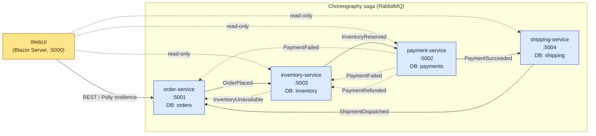

# Architecture — Saga e-commerce platform (`app/` repo)

> **Source of truth** for the application-side architecture.
> Last reviewed: **2026-06-15**.
> Repo scope: services + shared libs + tests + Dockerfiles + local compose. Kubernetes/Helm/Istio/ArgoCD live in the **gitops** repo.

## 1. Bounded contexts & service map



- **One DB per service** (Postgres, separate logical databases: `orders`, `payments`, `inventory`, `shipping`). No shared schemas, no 2PC.
- **No synchronous service-to-service calls inside the saga.** All inter-service edges are RabbitMQ events (solid arrows = forward, dashed = compensation).
- **WebUI** is the only synchronous consumer of the four service HTTP APIs and is the *only* place we run an HTTP resilience pipeline.

## 2. Event-Driven Architecture

| Concern | Decision |
|---|---|
| Broker | **RabbitMQ 3.13** (AMQP), management plugin enabled. |
| Client | **MassTransit 8.x** with the EF Core transactional outbox/inbox. |
| Topology | Default MassTransit RabbitMQ topology — one fan-out exchange per message type, one durable queue per consumer endpoint. |
| Endpoint naming | `KebabCaseEndpointNameFormatter(prefix: <service-name>)` so two services can register `PaymentFailedConsumer` without queue collisions. |
| Event naming | Past-tense facts: `OrderPlaced`, `PaymentSucceeded`, `PaymentFailed`, `InventoryReserved`, `InventoryUnavailable`, `InventoryReleased`, `ShipmentDispatched`, `OrderCancelled`, `OrderCompleted`, `PaymentRefunded`. |
| Contract location | [src/Shared/Saga.Shared.Contracts/Events.cs](../src/Shared/Saga.Shared.Contracts/Events.cs). All implement `ICorrelatedEvent` (`CorrelationId` + `OccurredAt`); MassTransit picks up `CorrelationId` by convention. |
| Event-carried state transfer | Production-realistic ordering: `OrderPlaced` carries items so `inventory-service` can reserve without calling back into `order-service`; `InventoryReserved` carries `CustomerId` + `Amount` + `Items` so `payment-service` can charge without callbacks; `PaymentSucceeded` carries `ReservationId` so `shipping-service` can link the shipment to the inventory hold. |
| Idempotency | MassTransit inbox (`AddInboxStateEntity`) + per-aggregate status guards (encapsulated in aggregate methods) + unique indexes on `(OrderId)` for `Payment`, `Reservation`, `Shipment`. |
| Optimistic concurrency | `[ConcurrencyCheck]` on saga-relevant state fields: `Order.Status`/`Stage`, `Payment.Status`, `Reservation.Status`, `ProductStock.Available`. EF Core includes them in UPDATE WHERE clauses; concurrent writes raise `DbUpdateConcurrencyException` and are reconciled by MassTransit's retry policy. No new schema columns. |
| Atomic publish | EF Core outbox: DB write and outbox row commit in the same transaction; relay publishes asynchronously. No dual-write inconsistency. |
| Dead-letter | RabbitMQ `<queue>_error` queues (MassTransit default). Inspectable in <http://localhost:15672>. |

### Saga flow

The flow is **reserve-then-charge** — the production-realistic order. Provisional inventory holds are cheap and reversible; refunding a card is expensive and slow, so we never charge until the order is fulfillable.

```
OrderPlaced ─▶ InventoryReserved ─▶ PaymentSucceeded ─▶ ShipmentDispatched ─▶ OrderCompleted
                │                       │
                ├── InventoryUnavailable │
                │   └── OrderCancelled   ├── PaymentFailed
                │   (no payment to       │   ├── InventoryReleased (release the hold)
                │    refund)             │   └── OrderCancelled
                │                       │
                └── timeout (watchdog)  └── timeout (watchdog @ PaymentSucceeded)
                                            ├── InventoryUnavailable (synthetic)
                                            ├── PaymentRefunded
                                            ├── InventoryReleased (via PaymentRefunded → release)
                                            └── OrderCancelled
```

## 3. Saga pattern (choreography)

- **Style:** Choreography. Each service owns its forward step *and* its compensating handler. No central orchestrator.
- **State machine on the aggregate.** [Order](../src/OrderService/Domain/Order.cs), [Payment](../src/PaymentService/Domain/Payment.cs) and [Reservation](../src/InventoryService/Domain/Models.cs) are rich aggregates that own their state transitions. Every legal transition is a method:
  - `Order.TryAdvanceStage(stage, now)` — forward only, while pending; idempotent for duplicates / out-of-order events.
  - `Order.Cancel(reason, now)` / `Order.Complete(now)` — idempotent; mutually exclusive (Completed cannot Cancel and vice-versa).
  - `Order.MarkTimeoutEmitted(now)` — one-shot guard for the watchdog.
  - `Payment.Authorize()` / `Payment.Decline(reason)` / `Payment.TryRefund(now)` — enforces transitions from `Pending` only.
  - `Reservation.TryRelease(now)` — idempotent compensation.
- **State tracking on Order:** `Order.Stage` enum (`OrderPlaced` → `InventoryReserved` → `PaymentSucceeded` → `ShipmentDispatched` → `Completed` / `Cancelled`) advanced by stage-tracker consumers in `order-service`. Stage trackers also use `TryAdvanceStage` so concurrent compensating writes don't lose the saga stage.
- **Saga timeout watchdog** — [OrderTimeoutWatchdog.cs](../src/OrderService/Saga/OrderTimeoutWatchdog.cs)
  - `BackgroundService` scans `Pending` orders past `Saga:Timeout:Total` (default 2 min) every `Saga:Timeout:ScanInterval` (default 5 s). Bound via strongly-typed [SagaTimeoutOptions](../src/OrderService/Saga/SagaTimeoutOptions.cs) with `ValidateOnStart()` and `[Range]` validation.
  - Emits **synthetic** failure events that already exist in the saga vocabulary, with **deterministic `MessageId`** = first 16 bytes of SHA-256 of `"{orderId}|timeout-…"` so re-emission inside MassTransit's 30-min duplicate-detection window is a no-op.
  - Stage → emitted event:
    - `OrderPlaced` (no reservation, no payment) → `InventoryUnavailable("(timeout)")` — order is cancelled; nothing to release or refund.
    - `InventoryReserved` (reserved, no payment) → `PaymentFailed("saga_timeout")` — `InventoryService.PaymentFailedConsumer` releases the hold; `OrderService.PaymentFailedConsumer` cancels.
    - `PaymentSucceeded` (reserved + paid, awaiting shipping) → `InventoryUnavailable("(timeout)")` — `PaymentService.InventoryUnavailableConsumer` refunds → publishes `PaymentRefunded` → `InventoryService.PaymentRefundedConsumer` releases the hold.
  - Calls `Order.MarkTimeoutEmitted(now)` (one-shot guard) so the watchdog won't re-pick the same row before the failure event is processed.
  - Wraps each emission in a `Saga.Choreography` activity named `saga.timeout.emit`.

## 4. Compensation map

| Trigger | Compensations |
|---|---|
| `InventoryUnavailable` (pre-payment) | `OrderCancelled` (order-service). No payment exists; nothing to refund. |
| `PaymentFailed` (post-reservation) | `InventoryReleased` (inventory-service releases the provisional hold); `OrderCancelled` (order-service) |
| `PaymentRefunded` (post-payment abort) | `InventoryReleased` (inventory-service releases the hold). Triggered by the watchdog's synthetic `InventoryUnavailable` at stage `PaymentSucceeded`, which cascades through `PaymentService` → `PaymentRefunded` → `InventoryService`. |
| Step timeout | Re-uses the failure paths above via the watchdog's synthetic events |

Every compensating handler is **idempotent** — the aggregate methods (`TryRefund`, `TryRelease`, `Cancel`) return `false` for repeat / out-of-status events so the consumer publishes nothing and persists nothing. Combined with `[ConcurrencyCheck]` this gives at-least-once messaging the safety of exactly-once effects.

## 5. Resilience patterns

| Where | Pattern | Implementation |
|---|---|---|
| Outbound HTTP from **WebUI → APIs** | Retry + Circuit Breaker + Total-/Attempt-Timeout + Concurrency limiter + correlation propagation | `AddStandardResilienceHandler()` from `Microsoft.Extensions.Http.Resilience` (Polly v8 pipeline) plus a [CorrelationForwardingHandler](../src/WebUI/Services/CorrelationForwardingHandler.cs) DelegatingHandler that propagates `X-Correlation-ID` from the active HTTP request onto every outbound call. `client.Timeout = Timeout.InfiniteTimeSpan` so the pipeline owns budgets, not `HttpClient`. See [WebUI/Program.cs](../src/WebUI/Program.cs). |
| MassTransit consumers | In-process exponential retry | `UseMessageRetry` (5 attempts, 200 ms → 10 s, exponential). Reconciles `DbUpdateConcurrencyException` from `[ConcurrencyCheck]` collisions and transient broker/db blips. After exhaustion the message is dead-lettered to `<queue>_error`. See [MassTransitExtensions.cs](../src/Shared/Saga.Shared.Infrastructure/MassTransitExtensions.cs). |
| Saga timeouts | Per-service watchdog | `OrderTimeoutWatchdog` (Option A — chosen over Quartz / saga-state-machine to keep the demo lightweight). Strongly-typed `SagaTimeoutOptions`. |
| HTTP API | Validation + ProblemDetails | Minimal-API `Results.ValidationProblem` on `POST /orders` for SKU / quantity / unit-price input. |
| Process | Liveness + readiness | `/healthz/live` (process-only), `/healthz/ready` (Postgres + RabbitMQ probes). |

> Note: long-tail **delayed redelivery** (e.g. retry in 1m / 5m / 15m) is intentionally **not** wired. It would require either the RabbitMQ delayed-exchange plugin or an external scheduler (Quartz / Hangfire). Retries + DLQ is sufficient for the demo's threat model.

## 6. Eventual consistency

- The saga is the **only** correctness mechanism. There is no distributed transaction.
- Each service's own DB transaction is local and atomic; cross-service consistency is achieved by the choreography graph + compensations.
- Final-state invariants enforced by tests (see §7):
  - `OrderCompleted` ⇒ all of `Payment.Succeeded`, `Reservation.Reserved`, `Shipment.Dispatched`.
  - `OrderCancelled` after `PaymentFailed` ⇒ no reservation, no shipment.
  - `OrderCancelled` after `InventoryUnavailable` ⇒ `Payment.Refunded`, no shipment.
  - Saga timeout ⇒ same compensations as the corresponding failure path.

## 7. Failure scenarios — automated validation

[tests/Saga.IntegrationTests/SagaSmokeTests.cs](../tests/Saga.IntegrationTests/SagaSmokeTests.cs) — Testcontainers (Postgres + RabbitMQ) + `WebApplicationFactory` per service + an out-of-band `EventCollector` MassTransit observer bus.

| Test | Forces | Asserts |
|---|---|---|
| `HappyPath_publishes_OrderCompleted` | Normal flow | `OrderCompleted` event + `Order.Completed` + `Payment.Succeeded` + `Reservation.Reserved` + `Shipment.Dispatched` within 30 s |
| `PaymentFailed_results_in_OrderCancelled_and_InventoryReleased` | `amount > 100_000` (over-limit injection); reservation already exists when payment fails | `PaymentFailed` → `InventoryReleased` → `OrderCancelled`; reservation final status `Released`; no shipment |
| `InventoryUnavailable_results_in_OrderCancelled_with_no_payment` | `OUT_OF_STOCK_*` SKU at the inventory-first hop | `InventoryUnavailable` → `OrderCancelled`; no payment record, no shipment |
| `Timeout_triggers_compensation` | `STALL_*` SKU stalls PaymentService 5 min after the reservation is taken; watchdog overridden to 8 s | Synthetic `PaymentFailed(reason: "saga_timeout")` → `InventoryReleased` → `OrderCancelled` with reason `timeout_emitted` or `payment_failed:saga_timeout`; reservation final status `Released` |

Sentinels (demo failure injectors) — see consumers:

| Trigger | Sentinel |
|---|---|
| Payment decline (card_declined) | SKU starts with `FAIL_PAY` |
| Payment decline (amount_over_limit) | `total > 100_000` |
| Inventory unavailable | SKU starts with `OUT_OF_STOCK` |
| Saga timeout | SKU starts with `STALL_` (5-min `Task.Delay` in PaymentService) |

## 8. Observability

| Signal | Source | Sink |
|---|---|---|
| Traces | OTel .NET SDK — ASP.NET Core, HttpClient, EF Core, MassTransit, manual `Saga.Choreography` ActivitySource | OTLP → OTel Collector → Jaeger (<http://localhost:16686>) |
| Metrics | OTel .NET SDK — ASP.NET Core, HttpClient, runtime, MassTransit + Prometheus exporter (`/metrics`) | Prometheus (<http://localhost:9090>) → Grafana (<http://localhost:3000>) |
| Saga business metric | `saga.terminal{outcome,reason}` `Counter<long>` on the `Saga.Choreography` meter — incremented by OrderService at every terminal transition. See [SagaMetrics.cs](../src/Shared/Saga.Shared.Infrastructure/SagaMetrics.cs). | Prometheus (`saga_terminal_total`) → Grafana "Saga terminal outcomes" + "Compensation ratio" panels |
| Logs | Serilog JSON, enriched with `service`, `correlationId`, environment | stdout (collected by container runtime) |
| Correlation | `X-Correlation-ID` middleware sets / reuses a `Guid` per request, pushes it into `Activity` baggage and `Serilog LogContext`; flows through MassTransit headers via the `CorrelationId` property convention | Jaeger trace + every log line + every event |
| Dashboard | [build/observability/grafana/provisioning/dashboards/saga-overview.json](../build/observability/grafana/provisioning/dashboards/saga-overview.json) | RED per service + saga forward vs compensation event rate + saga terminal outcomes (success rate vs compensation ratio) |

## 9. Code map

```
app/
├── src/
│   ├── Shared/
│   │   ├── Saga.Shared.Contracts/        # event records (no MassTransit dep)
│   │   └── Saga.Shared.Infrastructure/   # OTel, MassTransit+Outbox, Serilog,
│   │                                     #   correlation, JSON defaults, health
│   ├── OrderService/                     # Order aggregate + Saga.OrderTimeoutWatchdog
│   ├── PaymentService/
│   ├── InventoryService/
│   ├── ShippingService/
│   └── WebUI/                            # Blazor Server + Polly StandardResilienceHandler
├── tests/
│   ├── Saga.Shared.Contracts.Tests/      # contract-shape tests (incl. CorrelationId convention)
│   ├── Saga.OrderService.UnitTests/      # Order aggregate state-machine tests (no infra)
│   └── Saga.IntegrationTests/            # 4 saga scenarios via Testcontainers + WAF
├── build/
│   ├── docker/Dockerfile.dotnet          # parameterised by SERVICE_NAME
│   ├── observability/{otel-collector,prometheus,grafana}
│   └── postgres/init.sql                 # creates per-service DBs
├── docker-compose.yml                    # full stack (broker + dbs + obs + 5 services)
└── docker-compose.tests.yml              # test-time deps
```

## 10. Architecture decisions (locked)

1. **.NET 8 LTS**, ASP.NET Core minimal APIs, `WebApplication.CreateBuilder`.
2. **Choreography saga**, no orchestrator. Trade-off: harder to visualise globally; gained simplicity, no SPOF, no orchestration framework dependency.
3. **One DB per service** + transactional outbox. Trade-off: more operational surface; gained loose coupling and atomic publish.
4. **MassTransit + RabbitMQ** rather than NServiceBus / Wolverine / raw AMQP. Trade-off: framework lock-in; gained outbox/inbox/retry/topology out of the box.
5. **No delayed redelivery.** Trade-off: long-tail transient failures get DLQ'd faster than they would with `1m/5m/15m`. Acceptable for demo; would revisit before production.
6. **Watchdog inside `order-service`** (Option A) rather than a separate timeout service or a saga-state-machine. Trade-off: `order-service` now carries one saga-coordination concern; gained: zero extra infra, zero extra deployment unit, no orchestrator.
7. **`Microsoft.Extensions.Http.Resilience.AddStandardResilienceHandler`** rather than hand-crafted Polly v8 pipelines. Trade-off: less fine-grained control; gained: vendor-supported defaults aligned with .NET 8 guidance.

---

See companion document [`architecture-review-2026-06-15.md`](architecture-review-2026-06-15.md) for the gap analysis vs the original project goals.
